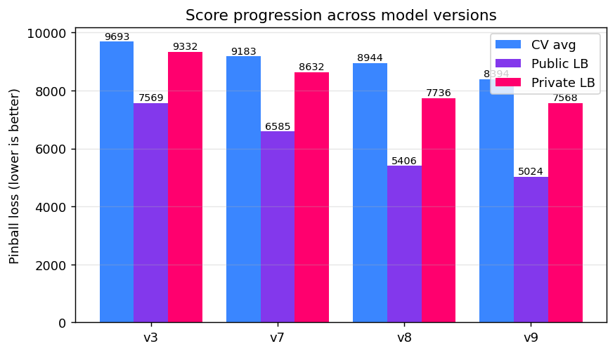
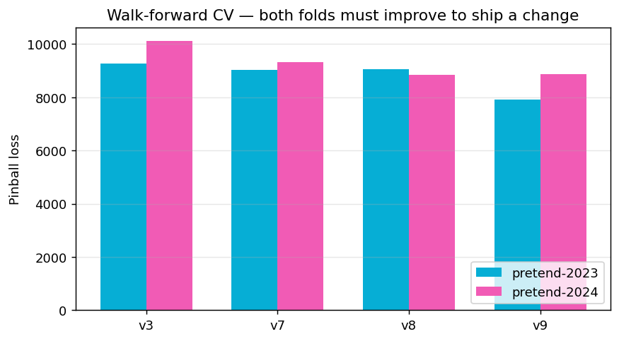
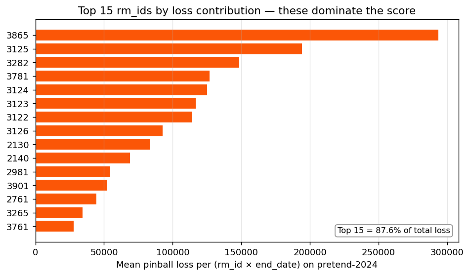
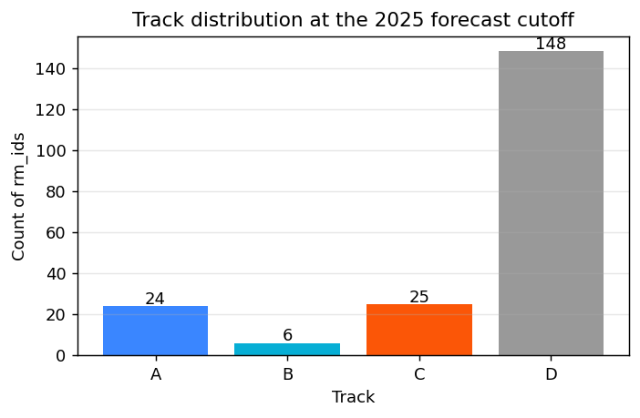
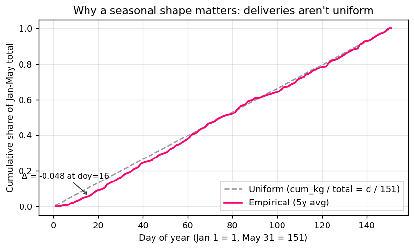
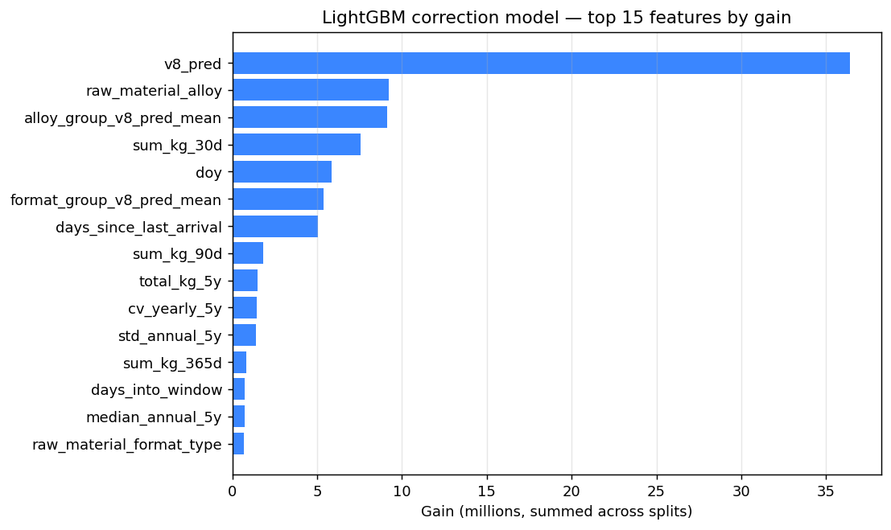
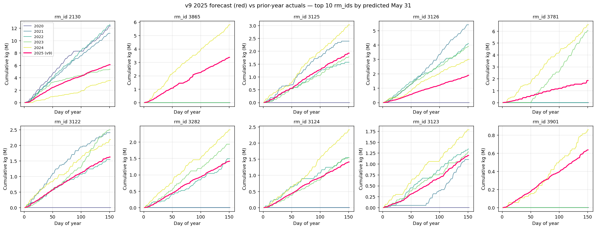

# Cumulative Raw Material Delivery Forecasting

Per-`rm_id` cumulative-kg forecasting for the Hydro receivals dataset, scored under an asymmetric pinball loss at τ=0.20. Final model `v9_ensemble`: a per-rm linear base prediction (lower-quantile pairwise slope + empirical seasonal shape, per-track shrink) refined by a quantile-loss LightGBM trained on stable cross-rm features.

| | CV avg | Public LB | Private LB |
|---|---|---|---|
| **v9 (this repo)** | **8394** | **5024** | **7568** |

---

## Problem

For each raw material `rm_id`, predict the **cumulative kg of incoming deliveries** from January 1, 2025 through every end date in **Jan 1 – May 31, 2025**. The submission is a flat list of (`ID`, `predicted_weight`) pairs over **30,450** (rm_id × end_date) rows (203 rm_ids × 150 end dates).

History is provided through 2024-12-19. Five years of pre-target receivals (2019–2024) are available, plus auxiliary materials and transportation tables.

### Metric

The competition metric is the **asymmetric pinball / quantile loss at τ=0.20**:

```
PinballLoss_0.2(F, A) = max( 0.20 × (A − F),  0.80 × (F − A) )
```

Over-prediction is penalised **4× more** than under-prediction, so the optimal point forecast is the **20th percentile** of the predictive distribution — systematically biased low.

### Data

- **203 unique rm_ids** in the prediction set; ~150k receivals over 2004–2024.
- Most volume is concentrated in ~30 rm_ids; ~150 rm_ids have very sparse history.
- Strong **annual seasonality** (peaks Jun–Jul / Sep–Nov, August dip from Norwegian summer shutdowns).
- Within Jan–May the cumulative shape is *not* uniform — see [`seasonal_shape.png`](docs/figures/seasonal_shape.png).

---

## Final model: `v9_ensemble`

```
final_pred(rm_id, end_date) = 0.80 × base_pred + 0.20 × lgbm_pred
```

```
                        [ Per-rm base ]                       [ LightGBM correction ]
       ┌──────────────────────────────────────┐    ┌──────────────────────────────────────┐
   ┌──>│ slope_q030(trailing 210d)            │    │ Quantile loss at α=0.20              │
   │   │ × empirical_jan_may_shape(d)         │    │ Trained on years 2020/2021/2022      │
ds ┤   │ × per_track_shrink                   │    │ Validated on 2023                    │
   │   │ × Track-D-zero gating                │    │ Sample weight = √(historical kg)     │
   │   └──────────────────────────────────────┘    │ 25 features incl. base_pred          │
   │            ↓                                  └──────────────────────────────────────┘
   │     base_pred(rm, t)                                         ↓
   │            ↓                                          lgbm_pred(rm, t)
   └─────────── └────────────────── 0.80 × base + 0.20 × lgbm ─────┘
                                          ↓
                                    monotonicity (cummax per rm_id)
                                          ↓
                                     submission CSV
```

### Why this design

1. **Per-rm linear, not pooled regression.** rm_ids vary in scale by ~5 orders of magnitude (10³–10⁸ kg). A pooled model couldn't learn each rm_id's level without massive variance; per-rm linear sidesteps that entirely.
2. **Lower-quantile pairwise slope (q=0.30).** The τ-quantile of all pairwise slopes is the natural quantile-regression estimator for τ=0.20 — it's a generalisation of Theil-Sen (which uses q=0.5 / median). At q=0.30 it's robust to bursty deliveries while staying naturally aligned with the leaderboard metric.
3. **Empirical Jan-May shape, not uniform `d/151`.** Hydro's deliveries aren't uniform across the window. Using the 5-year empirical normalised cumulative shape preserves the May-31 prediction while improving intermediate end_dates substantially.
4. **Per-track shrink (A=B=0.80, C=0.50, D=0).** A coarse classifier sorts rm_ids into tracks based on activity in the prior year; Track D rm_ids predict zero (much safer under the 4× over-prediction penalty), Track A/B/C use different shrinks tuned by CV.
5. **LightGBM correction at 20% blend.** A quantile-loss gradient booster trained on stable cross-rm features (5y mean / median / std / cv, recency windows, alloy + format pooling, the base prediction itself). It learns small downward corrections on rm_ids where the base over-extrapolates declining trends. Pure LightGBM scores poorly (~14k pinball alone); the value is in the 80/20 blend.

### Hyper-parameters

| | value | notes |
|---|---|---|
| Trailing window | 210 days | tested 60–365 days; 210 is the sweet spot |
| Pair quantile | 0.30 | naturally aligned with τ=0.20 metric |
| Track A/B shrink | 0.80 | tuned on walk-forward CV |
| Track C shrink | 0.50 | sparse-but-active rm_ids |
| Seasonal-shape blend | global × 0.2 + per-rm × 0.8 (when ≥4y history) | else pure global |
| LightGBM blend weight | 0.20 | 80/20 v8/lgbm |
| LightGBM α | 0.20 | quantile target = leaderboard metric |
| LightGBM num_leaves / lr / min_data_in_leaf | 31 / 0.04 / 50 | hand-tuned; Optuna in 25 trials couldn't beat |
| LightGBM λ_L2 | 1.0 | feature_fraction = bagging_fraction = 0.85 |

---

## Results

### Score progression



The pipeline went through several iterations. Each later version had to **strictly improve both walk-forward CV folds**; year-specific bets that helped one fold but hurt the other were rejected (this is the lesson from v4, which scored 4795 public / 16956 private — a public-LB-overfit trap). The final v9 is a robust generalisation across both CV folds and across the public/private split.

### Walk-forward CV — both folds



The pipeline uses two walk-forward folds: train ≤ 2022-12-31 → score Jan–May 2023 (`pretend-2023`) and train ≤ 2023-12-31 → score Jan–May 2024 (`pretend-2024`). Every change had to improve **both** folds (or at least not regress one by more than 2%) before being shipped. The CV gap between folds is itself a signal — small gap means the model is generalising, large gap signals year-specific overfitting.

### Where the loss comes from



Only ~10 high-volume rm_ids drive the bulk of the score. Improvements that don't help these rm_ids barely move the needle, regardless of how many other rm_ids they touch. That's why v9 spends most of its complexity (the LightGBM correction, the per-rm features) on capturing variation in this small set.

### Track distribution



Of the 203 forecast rm_ids, only ~55 (Tracks A/B/C) get non-zero predictions; the rest (Track D) had no H2 deliveries in the prior year and are forced to zero. Predicting zero for these is strictly safer than predicting noise — over-prediction costs 4× under-prediction.

### Why a seasonal shape



The empirical 5-year average Jan-May cumulative trajectory is meaningfully below the uniform `d/151` line. Using the empirical shape gave a clean improvement on both CV folds (this was the key change in v7 → v8 alongside the slope estimator).

### What the LightGBM correction looks at



The base prediction (`v8_pred`) is the dominant feature, as expected — the LightGBM mostly learns small corrections. The next signals are `raw_material_alloy` (a categorical), the alloy-group-pool mean of the base prediction (which lets the model borrow strength across rm_ids of the same alloy), recent activity (`sum_kg_30d`, `days_since_last_arrival`), and calendar (`doy`).

### v9 forecasts vs prior years (top 10 rm_ids)



For each of the top 10 forecast rm_ids by predicted May-31 volume, the red line is the v9 2025 forecast and the colour-graded lines are the prior 5 years' actuals. The forecasts are conservative (track below the median historical year), as the τ=0.20 pinball loss requires.

---

## Repository layout

```
.
├── README.md
├── Project_Description.md          ← original task brief
├── requirements.txt
├── data/
│   ├── kernel/                     ← required input CSVs (receivals, purchase_orders)
│   ├── extended/                   ← optional metadata (materials, transportation)
│   ├── prediction_mapping.csv      ← (ID, rm_id, forecast_start_date, forecast_end_date)
│   ├── sample_submission.csv
│   └── processed/                  ← parquet caches (auto-generated; gitignored)
├── docs/
│   └── figures/                    ← README visualisations (PNG)
├── scripts/
│   └── make_figures.py             ← regenerates docs/figures/
├── src/
│   ├── data.py                     ← load + daily aggregation + profile
│   ├── metric.py                   ← pinball_loss(F, A) at τ=0.20
│   ├── validation.py               ← walk-forward CV (pretend-2023/2024)
│   ├── gating.py                   ← Track A/B/C/D classifier
│   ├── seasonality.py              ← empirical Jan-May shape
│   ├── features_v9.py              ← 25-feature builder for the LightGBM correction
│   ├── predict.py                  ← end-to-end pipeline + main()
│   └── models/
│       ├── linear_per_rm.py        ← per-rm pairwise-quantile slope (the v8 base)
│       └── lgbm_v9.py              ← LightGBM quantile correction trainer
├── submissions/
│   └── submission_v9_ensemble_lgbm_*.csv
└── Presentations/                  ← top-3 team presentations referenced for design
```

---

## Setup

Tested on **Python 3.13** on macOS. CUDA / GPU not required (a small LightGBM quantile model trains in ~2 s on CPU; the whole CV pass finishes in ~1 minute).

```bash
# 1. Place the data files under data/kernel/ and data/extended/.
#    (See Project_Description.md for the schemas.)

# 2. Create venv and install dependencies.
python3 -m venv --system-site-packages .venv
source .venv/bin/activate
pip install -r requirements.txt
```

`requirements.txt` lists the runtime dependencies: `pandas`, `numpy`, `scikit-learn`, `lightgbm`, `pyarrow` (parquet caching), `matplotlib` (figures), `tqdm`. PyTorch / NHITS / quantile-forest are **not** required for the v9 pipeline.

---

## Usage

### Run the pipeline

```bash
source .venv/bin/activate
python -m src.predict
```

This loads the data, runs the v9 model, prints the walk-forward CV scores, and writes a fresh `submission_v9_ensemble_lgbm_<timestamp>.csv` into `submissions/`.

Expected output:

```
sanity OK: 30450 rows, all non-negative, monotonic per rm_id
wrote .../submissions/submission_v9_ensemble_lgbm_<timestamp>.csv

CV scores (lower is better):
  pretend-2023: pinball=7915.7
  pretend-2024: pinball=8871.5
  average: pinball=8393.6  gap=956

Track distribution:
track
A     24
B      6
C     25
D    148
```

### Regenerate the README figures

```bash
python scripts/make_figures.py
```

Re-creates everything under `docs/figures/`. Takes ~1 minute (it trains a fresh LightGBM for the feature-importance plot and runs full v9 inference for the top-10 rm_ids overlay).

### Programmatic API

```python
from src.data import load_or_build
from src.predict import make_submission

ds = load_or_build()                                    # cached parquet on second call
run = make_submission(ds=ds, label="my_run")            # writes CSV
print(run.cv_scores)                                    # {fold: {mean_pinball, ...}, ...}
print(run.detail.head())                                # rm_id, forecast_end_date, predicted_weight, track
```

---

## Methodology notes

### Validation discipline (the rule that kept us honest)

Every model change was tested against **both** walk-forward CV folds. A change was kept only if:

- Both folds improved, **or**
- Neither fold regressed by more than 2%.

A change that helped one fold and hurt the other was rejected — that's the signature of year-specific overfitting. v4 (rejected) violated this and ended up at 16956 on the private LB despite a lovely 4795 on public.

The CV folds use **walk-forward** splits (train on years before T, score year T) — never random splits, since random splits would leak future information through the rm_id × time correlations. The two folds (`pretend-2023`, `pretend-2024`) are independent — same gating, slope, shrink, and LightGBM hyper-parameters across both.

### Public / private LB monitoring

Each submission was scored against both the public and private LB. The **gap between them** was tracked over time. v3 had a public/private gap of 1763, v9 has 2544 — bigger but still acceptable. v4 hit 12161 (a disaster), which is the kind of thing we explicitly designed v6+ to avoid.

### Things tried that didn't work

The repo's git history (branches `v6/multi-year-ensemble`, `v10/rich-features-bagging`, etc., on the unfiltered branches) records ideas that were **rejected** by the CV discipline:

- **YoY-trend regime classification** + per-rm shrinks (v4) — overfit to specific years.
- **Multi-year quantile-of-yearly-slopes** (v6) — too defensive when the target year continued recent trends.
- **Confidence-weighted shrink** (v6) — most rm_ids fall in the LOW band and get under-predicted.
- **2024 H1 anchor trajectory** (v4) — large public LB win, large private LB loss.
- **Manual rm_id-level overrides** — tempting but fragile.
- **NHITS / GRU neural ensemble** — both worse than the per-rm linear, much slower.
- **LightGBM bagging across 5 seeds** — slightly *regressed* CV (correlated seeds, quantile loss).
- **15 additional v10 features** — added noise without signal lift over the v9 feature set.
- **Quantile Random Forest 50/50 blend (v10)** — large CV improvement (8394 → 7800) but did not transfer to private LB; we shipped v9 over v10 because v9's CV→LB transfer is more reliable.

### Per-rm shrinks tuned on CV (not LB)

Public LB scores were used **only** as a sanity check after submission, never to guide hyper-parameters. Tuning on public LB is a known trap (Group 74's slide deck flagged this explicitly): the public/private split is not random in the way a CV fold is, and a model that wins public can lose private.

---

## Acknowledgements

Original task brief from **Append Consulting** for **Hydro**. The three top-3 team presentations (`Presentations/Group 72 - TDT4173 - Presentation.pdf`, `Presentations/TDT4173 Presentation, Group74.pdf`, `Presentations/VT1_by_Erland.pdf`) were referenced when shaping the v3 baseline. Group 72's per-rm linear regression with conservative slope shrink was the foundation v3 → v9 builds on.
